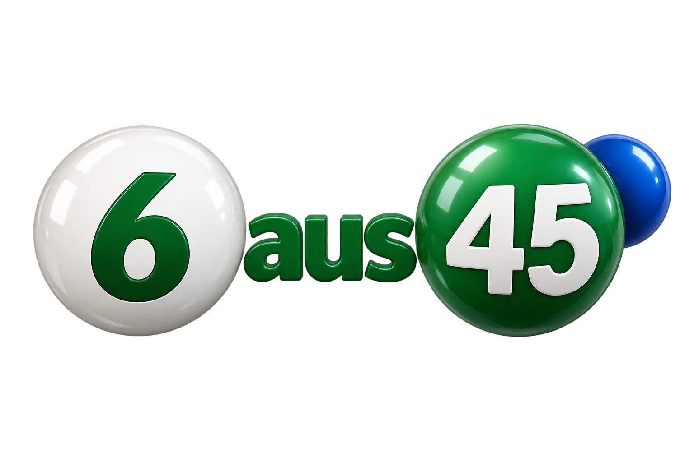

# Logo „6 aus 45“ · Version 1

Erstellt am 15.09.2026 mit dem integrierten ImageGen-Werkzeug (Built-in-Modus).
Format: PNG, 1536 × 1024 Pixel, RGBA mit transparentem Hintergrund.

## Gespeicherte Dateien

- Projekt: `/home/josef/Labor/Python/6aus45/resources/logo-6aus45-v1.png`
- 3D-Sammlung: `/home/josef/Bilder/3d projekte/6aus45/logo-6aus45-v1.png`
- Download: `/home/josef/Documents/Codex/2026-09-15/a/outputs/logo-6aus45-v1.png`

Neue eigenständige Logodatei. Die bisherigen Programmicons wurden nicht ersetzt.
Herkunft: KI-generiert, ohne externe Bildvorlage. Farben und Lotto-Kugeln folgen dem bestehenden Projekt.
Projektlizenz: GPL-3.0-only; diese Herkunftsangabe beim Weitergeben beibehalten.

SHA-256: `3dfc8a73eb79fccf390e8a9ed533f6296aa993f957e952fb8e4e2a71d460cd66`



## Verwendeter Prompt

```text
Use case: logo-brand.
Create a polished original 3D logo for a German-language lottery statistics desktop application named exactly "6 aus 45".
Asset: one finished standalone logo, centered on a truly transparent background with an alpha channel, generous clear padding on all sides, no mockup. Landscape composition, approximately 3:2 canvas.
Design: a large pearl-white lottery ball on the left bearing a bold perfectly legible forest-green "6"; a rich emerald-green lottery ball on the right bearing a perfectly legible white "45"; between these balls the smaller lowercase word "aus" in sturdy deep-green dimensional sans-serif lettering. Read clearly from left to right as "6 aus 45". A small cobalt-blue sphere partly behind the right ball provides the existing application's blue Joker accent and bears no lettering. Keep the mark compact and balanced, with the two numbered balls of equal visual weight.
Materials and lighting: refined satin ceramic, unmistakable rounded 3D depth, restrained highlights from upper left, gentle realistic contact shadows belonging only to the objects, clean edges, excellent legibility at small size. Mostly white, emerald green and cobalt blue, matching lottery balls.
Text verbatim: "6 aus 45". Render all three parts once, with "aus" spelled a-u-s in lowercase. Only the described logo, no other text, slogan, watermark, casino elements, coins, confetti, border, panel or scene. Do not imitate any existing lottery operator's logo. Keep every element wholly inside the canvas. The empty background must be transparent, not a checkerboard illustration.
```
